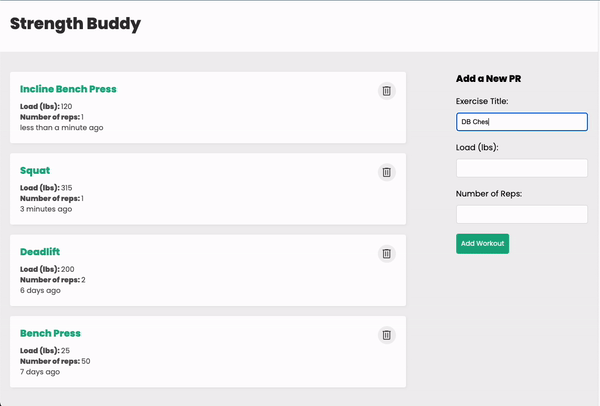

  

  
  
  

I'm a passionate Software Engineer with a proven track record of creating and implementing successful full stack web applications. I love software development's creative and technical aspects and am passionate about all things tech-related! As a problem solver at heart, I love the perpetual learning involved with software engineering and enjoy the dynamic nature of development. Outside the world of tech, I enjoy weightlifting, snowboarding, and cooking. Lets connect!

See [my website](https://hansontram.netlify.app/) for more information!

<h1 align="center">Recent Projects</h1>
<table bordercolor="#66b2b2">
  
  <tr>
    <td width="50%" valign="top">
      <h3 align="center">Iron Maps</h3>
         
        
         
      
   
        
      
      

      
 Iron Maps is a gym finder for enthusiasts and strength athletes. We make it easy to find a specialized training facility with our curated directory of gyms.

    </td>
    <td width="50%" valign="top">
    <h3 align="center">SupaCook Recipes</h3>
       
      
       
    

          
    
  
    

    
A recipe generator app. This web app offers users the ability input a main ingredient and generates recipe ideas from the Edamam Api.

  </td>
  </tr>
  <tr>
  <td width="50%" valign="top">
      <h3 align="center">TBD</h3>
         
        
         
      

          
    
  
    

    
A fullstack workout log where users can record their personal records in the gym. 

  </td>

<!--   <td width="50%" valign="top">
      <h3 align="center">TBD</h3>
         
      
         
        

          
  
  
      

    
A streamlined productivity application allowing users to quickly add, update, and delete their notes.

  </td>
  </tr> -->

</table>

<h1 align="center">Technologies</h1>

    
    
    
    
    
    
    
    
    

---

<h1 align="center">Blogs</h1>

<!-- BLOG-POST-LIST:START -->
- [Learning how to learn](https://medium.com/@hansontram/learning-how-to-learn-859910651a50)
- [An update on my journey](https://medium.com/@hansontram/an-update-on-my-journey-1-year-later-cc8e4bd95a73)
- [To New Beginnings...](https://medium.com/@hansontram/to-new-beginnings-c7905adc9460)
<!-- BLOG-POST-LIST:END -->
